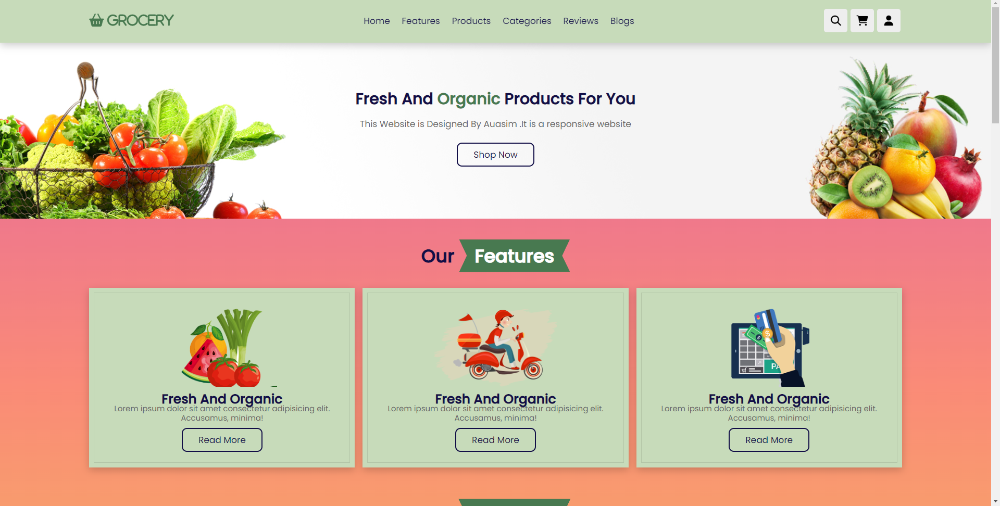

# Grocery-App

# project--documentation

<p align="center">
  <a href="https://auasim.github.io/Grocery-App/" rel="noopener">
 
  <p>click the image to see the Grocery UI</p></a>


<h3 align="center">Personal Portfolio</h3>

---

<p align="center"> Few lines describing your project.
    <br> 
</p>

## 📝 Table of Contents
- [About](#about)
- [Getting Started](#getting_started)
- [Deployment](#deployment)
- [Usage](#usage)
- [TODO](../TODO.md)
- [Contributing](../CONTRIBUTING.md)
- [Acknowledgments](#acknowledgement)

## 🧐 About <a name = "about"></a>
Grocery refers to food items and household goods that are sold by retailers, such as supermarkets, grocery stores, and online grocers, for consumption and use by households. Grocery shopping is a routine activity for most people and typically involves buying items such as fresh produce, meat, dairy products, packaged goods, and cleaning supplies.

Grocery stores offer a wide range of products to meet the diverse needs and preferences of customers. They may also offer specialty items, such as organic or gluten-free products, international foods, and local or regional products.

Grocery shopping has evolved over time, with many retailers now offering online ordering and home delivery services for added convenience. This has become particularly popular during the COVID-19 pandemic, with many people opting to shop online to minimize their exposure to the virus.

Overall, grocery shopping and the food industry as a whole play an important role in our daily lives, providing us with the essential items we need to nourish ourselves and our families.

## 🏁 Getting Started <a name = "getting_started"></a>
These instructions will get you a copy of the project up and running on your local machine for development and testing purposes. See [deployment](#deployment) for notes on how to deploy the project on a live system.

### Prerequisites
What things you need to install the software and how to install them.

```
Give examples
```

### Installing
A step by step series of examples that tell you how to get a development env running.

Say what the step will be

```
Give the example
```

And repeat

```
until finished
```

End with an example of getting some data out of the system or using it for a little demo.

## 🔧 Running the tests <a name = "tests"></a>
Explain how to run the automated tests for this system.

### Break down into end to end tests
Explain what these tests test and why

```
Give an example
```

<<<<<<< HEAD


=======
>>>>>>> ccb3ef98e38119bc8d4d95dd9750ea018ced0479
## 🎈 Usage <a name="usage"></a>
Add notes about how to use the system.

## 🚀 Deployment <a name = "deployment"></a>
Add additional notes about how to deploy this on a live system.


- [HTML]
- [CSS]
- [JavaScript]
- [Swipper Library]


See also the list of [contributors](https://github.com/kylelobo/The-Documentation-Compendium/contributors) who participated in this project.

## 🎉 Acknowledgements <a name = "acknowledgement"></a>
- Hat tip to anyone whose code was used
- Inspiration
- References
